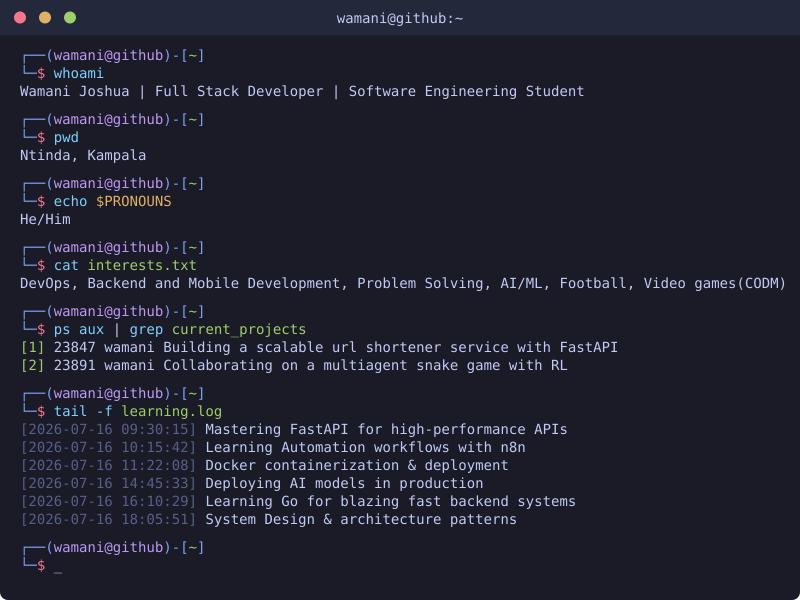

# Hi, I'm Wamani Joshua

  

---

## About Me

---

## Technical Skills

### Frameworks

### Databases

### DevOps

### Mobile Development

### Tools & Software

---

## Currently Focusing On

---

## Profile Visits & Activity

---

## GitHub Statistics

### 💻 Most Used Languages

### 📊 Contribution Activity

### 🏆 GitHub Trophies

---

## Current Focus

<table align="center">
<tr>
<td width="50%">

### Working On

- Building a scalable url-shortener service with FastAPI
- Collaborating on a multiagent snake game with RL similar to Battle Royale in codm

</td>
<td width="50%">

### Learning

- Mastering FastAPI for high-performance APIs
- Docker containerization & deployment
- Deploying AI models to production
- Go programming language
- System design & architecture patterns

</td>
</tr>
</table>

---

## Let's Collaborate

I'm looking to collaborate on:

- AI-powered CLIs and tools
- Open source projects
- Real-world challenging applications

**Status:** Open to work and new opportunities

---

### Thanks for visiting

<!---
jwamani/jwamani is a ✨ special ✨ repository because its `README.md` (this file) appears on your GitHub profile.
You can click the Preview link to take a look at your changes.
--->
